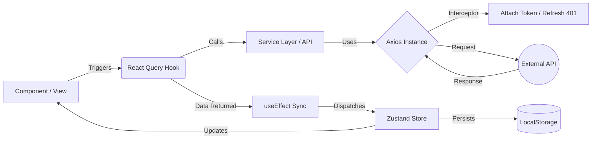

# Developer Documentation & Codebase "Source of Truth"

> **Role:** Senior Technical Lead & Software Architect
> **Objective:** Standardization of onboarding, contribution, and architectural patterns.

---

## I. Architecture Overview

### 1. Project Reference Tree

This directory structure enforces a clear separation between **Views** (`app`), **UI Primitives** (`components`), and **Business Logic/Data** (`data`).

```text
/
├── app/                  # Next.js App Router (Views & Pages only)
│   ├── (auth)/           # Authentication routes (Login, Register)
│   └── (features)/       # Protected application routes (Dashboard, Posts)
├── components/           # UI Layer
│   ├── ui/               # Atomic (Shadcn/Radix) primitives. PURE UI.
│   ├── custom/           # Composite/Feature-specific components (e.g., Navbar).
│   └── provider/         # Global Context Providers.
├── data/                 # The "Brain" of the application (Logic Layer)
│   ├── axios/            # Network Configuration
│   │   ├── client.config.ts      # Global Axios Instance
│   │   ├── client.interceptor.ts # Auth Token & Retry Logic
│   │   └── tokenService.ts       # LocalStorage Token Management
│   ├── queries/          # Server State (React Query)
│   │   └── services/     # Feature-based API Services
│   │       ├── auth/     # (api.ts = Raw Calls, call-hooks.ts = React Query Loops)
│   │       └── posts/
│   └── stores/           # Client State (Zustand)
│       ├── auth/
│       └── middleware.ts # Persistence Configuration
└── types/                # Shared TypeScript Interfaces
```

### 2. The Data Flow: "The Sync Pattern"

We utilize a hybrid state management strategy where **React Query** fetches the data, and a `useEffect` synchronization loop pushes that data into **Zustand** for global accessibility and persistence.



---

## II. Core Conventions (The "Docs")

### 1. State Management Strategy

- **Server State (Fetching)**: ALWAYS use **TanStack React Query**. hooks located in `data/queries/services/*/call-hooks.ts`.
- **Client State (Storage)**: ALWAYS use **Zustand**. Stores located in `data/stores/*/`.
- **The "Sync" Rule**: Never use React Query data directly for persistent user sessions. You must sync successful query results into the Zustand store using `useEffect` within the hook itself.

### 2. API & Networking

- **Instance**: All network requests MUST use the `axiosClient` exported from `@/data/axios/client.config.ts`.
- **Interceptors**: Automatic 401 handling is pre-configured. If a `401 Unauthorized` occurs, the interceptor pauses requests, attempts a token refresh, and retries. If refresh fails, it redirects to login.
- **Pattern**:
  - `api.ts`: Pure `axios.get/post` calls. No React logic.
  - `call-hooks.ts`: Custom Hooks wrapping `useQuery` / `useMutation`.

### 3. Persistence

- Local Storage is managed via Zustand middleware (`withPersist`).
- Configured in `@/data/stores/middleware.ts`.
- Use it for data that needs to survive a page reload (Auth tokens, User Profile, Theme).

---

## III. Developer Workflows (How-To Guides)

### Scenario A: "I need to add a new Feature (e.g., 'Comments')"

1.  **Define Types**: Create `CommentInterface` in `types/`.
2.  **Create Service**:
    - New file: `data/queries/services/comments/api.ts`.
    - Add raw axios methods: `getComments`, `postComment`.
3.  **Create Store (If Global)**:
    - New file: `data/stores/comments/useCommentStore.ts`.
    - Define State & Actions. Use `withPersist` if needed.
4.  **Create Hook**:
    - New file: `data/queries/services/comments/call-hooks.ts`.
    - Export `useGetComments`.
    - **CRITICAL**: Inside `useGetComments`, add a `useEffect` that updates `useCommentStore` when `query.data` changes.
5.  **Build UI**:
    - Create `components/custom/CommentList.tsx`.
    - Use the hook: `const { data } = useGetComments();`.

### Scenario B: "I need to update Business Logic"

- **Rule**: NEVER write business logic inside a Component (`.tsx` in `app/` or `components/`).
- **Where to go**:
  - If it's data transformation: do it in the **Hook** (`call-hooks.ts`).
  - If it's a global state change: do it in the **Store Action** (`useXStore.ts`).
  - If it's an API change: do it in the **Service** (`api.ts`).

### Scenario C: "I need to create a reusable Component"

- **1. Is it a Generic/Global Component?** (e.g., Navbar, Sidebar, ModeToggler)
  - **Place in:** `components/custom/`.
  - **Rule:** These must be usable on _any_ page of the application.
- **2. Is it a Shadcn/UI Primitive?** (e.g., Button, Input, Sheet)
  - **Place in:** `components/ui/`.
  - **Rule:** **DO NOT** manually add files here. This directory is reserved for Shadcn CLI auto-generated components.
- **3. Is it Feature-Specific?** (e.g., `LoginForm`, `PostCard`)
  - **Place in:** A `_components` or `components` folder _next to_ the page attempting to use it.
  - **Example:** `app/(auth)/login/components/LoginForm.tsx`.
  - **Rule:** If it is ONLY used in one specific view/feature and not shared, keep it, collocated.

---

## IV. Implementation Guide & Patterns

### 1. The "Barrier Export" Pattern (Index Files)

We use `index.ts` files to create clean public APIs for our modules. This prevents "import hell".

- **Rule**: Every module (folder) in `data/` or `components/` should have an `index.ts` if it exports multiple items.
- **Example**:
  ```typescript
  // data/stores/index.ts
  import { useAuthStore } from "./auth/useAuthStore";
  import { usePostStore } from "./posts/usePostStore";
  export { useAuthStore, usePostStore };
  ```
- **Usage**: `import { useAuthStore } from "@/data/stores";` (Cleaner than `data/stores/auth/useAuthStore`)

### 2. Creating a New Feature (The "Vertical Slice")

Follow this exact order to implement a new data-driven feature.

#### Step 1: The Type

Define the shape of your data in `types/index.ts` (or specific file).

```typescript
export interface WidgetInterface {
  id: number;
  name: string;
}
```

#### Step 2: The Service (Raw API)

Create `data/queries/services/widgets/api.ts`.

```typescript
import axiosClient from "@/data/axios/client.config";
import { WidgetInterface } from "@/types";

export const widgetApi = {
  get: () => axiosClient.get<WidgetInterface[]>("/widgets"),
  create: (payload: any) => axiosClient.post("/widgets", payload),
};
```

#### Step 3: The Store (Client State)

Create `data/stores/widgets/useWidgetStore.ts`.

```typescript
import { create } from "zustand";
interface WidgetState { widgets: WidgetInterface[]; setWidgets: (w: WidgetInterface[]) => void; }
export const useWidgetStore = create<WidgetState>((set) => ({ ... }));
```

#### Step 4: The Hook (The Sync Layer)

Create `data/queries/services/widgets/call-hooks.ts`.

```typescript
export function useGetWidgets() {
  const setWidgets = useWidgetStore((s) => s.setWidgets);
  const query = useQuery({ queryKey: ["widgets"], queryFn: widgetApi.get });

  useEffect(() => {
    if (query.data) setWidgets(query.data.data);
  }, [query.data, setWidgets]);

  return query;
}
```

---

## V. Code Standards

### Do's ✅

- **DO** use strict TypeScript interfaces for all API responses.
- **DO** use the `axiosClient` instance for **all** HTTP requests.
- **DO** utilize the `useEffect` Sync Pattern to keep Zustand stores updated with fresh server data.
- **DO** place all mutation logic (POST/PUT/DELETE) in `call-hooks.ts` using `useMutation`.

### Don'ts ❌

- **DON'T** use `fetch` API directly. You will lose Auth interceptor support.
- **DON'T** call React Query hooks directly in `layout.tsx` (Client Component limitations).
- **DON'T** store derived data in Zustand (calculate it in the Component or Memoize it).
- **DON'T** put API calls inside Components. Always wrap them in a service hook.
